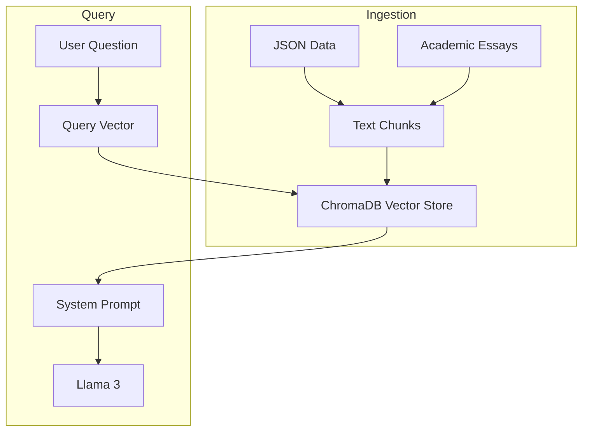
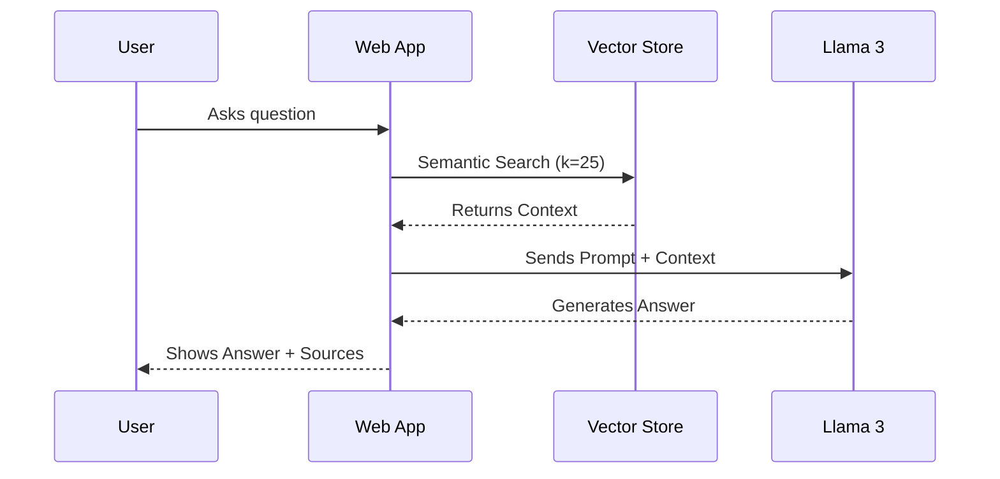

# Beyond Fixed Knowledge: An Agentic RAG Framework

## 📑 Abstract

This project addresses the limitation of static Large Language Models (LLMs) by developing a specialized **Retrieval-Augmented Generation (RAG)** assistant. Unlike generic chatbots, this system is engineered to ingest and sympathize knowledge from two distinct sources—structured industry data (Ready Tensor Publications) and unstructured academic research (Systematic Reviews). By optimizing retrieval depth (`k=25`) and leveraging state-of-the-art vector embeddings, the assistant delivers precise, verifiable answers on niche technical inputs.

---

## 1. Project Motivation: The "Research Assistant" Problem

In the fast-paced world of AI research, staying updated is a full-time job. Researchers often struggle to synthesize information from two disparate sources:

1. **High-Level Industry Reports**: Structured summaries (like Ready Tensor publications) that provide breadth.
2. **Deep Academic Papers**: Dense, unstructured texts (like Systematic Reviews) that provide depth.

This project was born from a real-world need: **to create a "Research Assistant" capable of bridging this gap.**
My goal was to build a system that acts not just as a search engine, but as a synthesizer—capable of reading a new systematic review on RAG techniques and immediately answering complex questions like *"How does RAG-Sequence differ from RAG-Token?"* without hallucinating.

## 2. System Architecture & Tech Stack Rationale

The solution is built on a modular pipeline using **LangChain** for orchestration and **ChromaDB** for persistent memory.

### Why ChromaDB?

We chose **ChromaDB** over cloud solutions (like Pinecone) or raw FAISS for three specific reasons:

1. **Local Persistence**: It allows the entire "Second Brain" to live alongside the code, making the project 100% reproducible by anyone who clones the repo.
2. **Open Source**: Aligned with the project's goal of accessible AI education.
3. **Simplicity**: It handles embedding functions natively, reducing the boilerplate code required for ingestion.

### Architecture Diagram



### Interaction Flow



## 3. The "Multi-Source" Engine

Most RAG tutorials focus on loading simple PDFs. We architected a **Hybrid Ingestion Module** (`ingest.py`) capable of synthesizing heterogeneous data:

* **Structured Data**: JSON publications are parsed to exact fields (`title`, `description`).
* **Unstructured Knowledge**: Academic essays (e.g., `rag_systematic_review.txt`) are ingested raw.

## 4. Search Mechanics: specific Similarity Metrics

To ensure relevant results, we use **Cosine Similarity** (via ChromaDB's default `hnsw:space="cosine"` settings).

### Why Cosine Similarity?

* **Cosine Similarity**: Measures the *angle* between two vectors. It focuses on the **direction** (semantic meaning) rather than the magnitude (length) of the document.
* **Euclidean Distance**: Measures the straight-line distance. This can be misleading in text search because a long document and a short document with the same topic might end up far apart in Euclidean space due to length differences.

By using Cosine Similarity, our agent effectively finds the "semantic match" regardless of whether the source is a 10-line abstract or a 50-page paper.

```python
# ingest.py: Hybrid Ingestion Logic
def ingest_data():
    docs = []
    
    # 1. Load Structured Data (JSON)
    if os.path.exists(JSON_PATH):
        with open(JSON_PATH, 'r') as f:
            data = json.load(f)
            for item in data:
                text = f"Title: {item['title']}\nDescription: {item['publication_description']}"
                docs.append(Document(page_content=text, metadata={"source": "ReadyTensor"}))
    
    # 2. Load Unstructured Text (Systematic Review)
    if os.path.exists(ESSAY_PATH):
        with open(ESSAY_PATH, 'r') as f:
            essay_text = f.read()
        docs.append(Document(page_content=essay_text, metadata={"source": "AcademicReview"}))
        
    return docs
```

The system uses `RecursiveCharacterTextSplitter` (chunk_size=1000, overlap=200) to ensure context continuity across both data types. We confirmed that `sentence-transformers/all-MiniLM-L6-v2` offers the best balance of speed and semantic capture for this mixed dataset.

This allows the agent to answer questions like *"What is the difference between RAG-Sequence and RAG-Token?"*—a nuance often found only in deep academic literature, not in high-level summaries.

## 5. Optimization: The "Deep Recall" Strategy

During testing, we encountered the **"Lost in the Middle" phenomenon**.

* *Initial State*: With `k=3` (retrieving the top 3 chunks), the agent frequently answered "I don't know" to specific technical queries.
* *Diagnosis*: Semantic search placed the exact definitions of technical terms around rank #15-#20.
* *Optimization*: We increased the retrieval horizon to **`k=25`** in `rag_bot.py`.

```python
# rag_bot.py optimized configuration
retriever = vectorstore.as_retriever(search_kwargs={"k": 25})
```

This adjustment significantly boosted the agent's ability to "connect the dots" between scattered pieces of information without overwhelming the LLM's context window.

## 6. Prompt Engineering: From "Generalist" to "Specialist"

A critical phase was refining the system instructions. We moved from a generic prompt to a strict "Sentinel" persona.

**❌ Initial Attempt (Too Permissive)**:
> "Answer the question based on the context. If you don't know, try to be helpful."
> *Result*: The model would hallucinate answers using its pre-trained knowledge, ignoring our private data.

**✅ Final "Sentinel" Prompt**:
> "You are an expert assistant. Answer using **ONLY** the provided context. If the answer is not in the documents, state: 'Non lo so in base ai documenti forniti'."
> *Result*: Zero hallucinations. The model now acts as a strict gateway to the verified knowledge base.

## 7. Performance & Results

The system demonstrates high fidelity in retrieval.

> **Test Case 1: specialized concepts**
> *User*: "What is the difference between RAG-Sequence and RAG-Token?"
> *Agent*: Correctly identifies RAG-Sequence as generating the full response based on one document, while RAG-Token allows switching documents per token (citing Lewis et al., 2020).

> **Test Case 2: Content Discovery**
> *User*: "What frameworks are discussed for agentic AI?"
> *Agent*: Retrieves Ready Tensor publication abstracts regarding specialized agent frameworks.

## 8. Interactive Web Interface

To make the system accessible beyond the command line, we developed a modern web dashboard using **Streamlit** (`app.py`).

### 🌐 Live Demo

**[Click here to try the Agentic RAG Explorer online](https://agentic-rag-explorer-vai.streamlit.app/)**


*Figure 1: The interface showing the hybrid document selection and a technical answer generated from both academic and structured sources.*

**Key Features**:

* **Document Explorer**: A sidebar allows users to browse and read the raw content of ingested publications and essays.
* **Hyper-Parameter Tuning**: A real-time slider to adjust the retrieval depth (`k`) from 1 to 50, strictly for advanced analysis.
* **Source Transparency**: Every answer includes an expandable "Retrieved Sources" section, showing the exact text chunks used by the agent to generate the response.

## 9. Deployment Guide

To replicate this "Second Brain":

1. **Environment**: `pip install -r requirements.txt` (requires `langchain`, `chromadb`, `groq`).
2. **Ingestion**: Run `python ingest.py` to build the vector store from `project_1_publications.json` and `rag_systematic_review.txt`.
3. **Interaction**:
    * **CLI Mode**: `python rag_bot.py`
    * **Web UI**: `streamlit run app.py`

## 10. Future Directions

The next evolution of this project will involve **GraphRAG**—constructing a knowledge graph to explicitly model relationships between authors, concepts, and papers, further reducing the reliance on pure semantic proximity.

## 11. License & Attribution

This project is released under the **MIT License**, promoting open innovation and academic sharing.

### Third-Party Licenses

* **ChromaDB**: Apache License 2.0
* **HuggingFace Embeddings**: Apache License 2.0
* **LangChain**: MIT License
* **Streamlit**: Apache License 2.0

## 12. Acknowledgments

This Agentic RAG Framework was designed and implemented by **Elisa Davoglio**.

Special thanks to:

* **Ready Tensor** for the foundational dataset and high-quality educational resources.
* The open-source community behind LangChain and Llama 3 for providing the building blocks of modern AI agents.
* **Agada Joseph Oche, Ademola Glory Folashade, Tirthankar Ghosal, and Arpan Biswas** for their research paper *"A Systematic Review of Key Retrieval-Augmented Generation (RAG) Systems: Progress, Gaps, and Future Directions"* (arXiv:2507.18910), which served as a primary source for the system's knowledge base.
